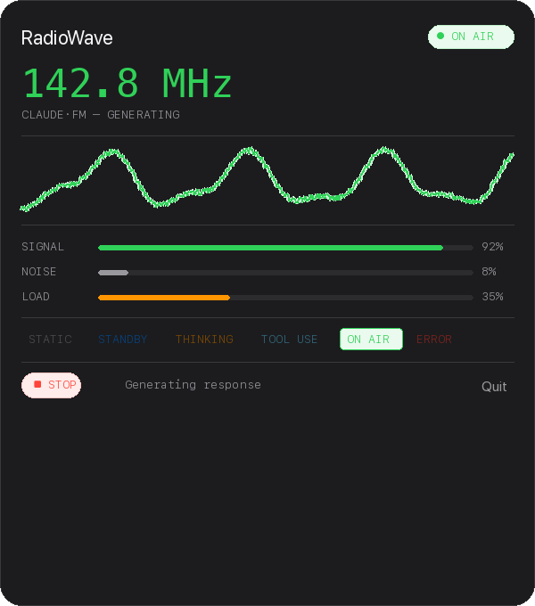

# RadioWave

**Hear your AI think.** A macOS menubar app that plays radio-signal audio feedback based on real-time Claude Code activity.

RadioWave turns Claude Code into a radio station. When Claude is thinking, you hear a contemplative drone. When it's running tools, you hear data-modem pulses. When it's generating a response, rich FM synthesis fills the air. When it's idle, warm atmospheric static crackles in the background — like a shortwave radio between stations.

  

<p align="center">
  
</p>

## How It Works

RadioWave installs [Claude Code hooks](https://docs.anthropic.com/en/docs/claude-code/hooks) that send real-time HTTP events to a local server running inside the app. Every prompt, tool call, and response triggers a state change with its own audio signature.

| Claude Code State | RadioWave Audio |
|---|---|
| No session | Warm atmospheric static with stereo crackle, distant sweep ghosts, faint morse fragments |
| Session active, waiting | Clean presence hiss with detuned stereo pilot tone |
| Processing prompt | Contemplative drone — chord, oceanic pad, or number station (randomized) |
| Running a tool | Mechanical clockwork, dialup modem, or teletype pulses (randomized) |
| Generating response | Rich FM synthesis, music-box arpeggio, or deep pulsar rhythm (randomized) |
| Error / signal lost | Descending siren or digital glitch with static burst |

Every transition plays a **tuning-dial sweep** — static fragments resolving into the new signal, like turning a physical radio knob.

## Features

- **Procedural audio** — all sounds generated in real-time via AVAudioEngine, no samples
- **Randomized variants** — each state has 2-3 sound presets that rotate so it never gets stale
- **Stereo spatial audio** — crackles pan between ears, drones shimmer across channels
- **Tuning transitions** — state changes sound like turning a radio dial
- **Animated waveform** — 60fps Canvas visualization driven by state
- **Signal meters** — real-time signal strength, noise level, and CPU load bars
- **Demo mode** — click state buttons to preview sounds without live monitoring
- **Full settings** — volume, static intensity, idle static toggle, launch at login
- **Claude Code hooks** — auto-installed on first launch, zero config needed
- **Fallback detection** — session JSONL file watching if hooks aren't available
- **Menubar only** — no Dock icon, no main window, lives in your menubar

## Requirements

- macOS 14 (Sonoma) or later
- [Claude Code](https://docs.anthropic.com/en/docs/claude-code) installed
- Xcode 15+ (to build from source)
- [XcodeGen](https://github.com/yonaskolb/XcodeGen) (`brew install xcodegen`)

## Build & Run

```bash
git clone https://github.com/hirakcoder/RadioWave.git
cd RadioWave
xcodegen generate
open RadioWave.xcodeproj
```

Build and run (Cmd+R) in Xcode. The app appears in your menubar as a signal-bars icon.

On first launch, RadioWave automatically installs hooks into `~/.claude/settings.json`. Start a Claude Code session and you'll hear it come alive.

## Project Structure

```
RadioWave/
├── RadioWaveApp.swift           # App entry point
├── AppDelegate.swift            # Menubar, popover, subsystem coordination
├── Views/
│   ├── PopoverView.swift        # Main panel with waveform, meters, controls
│   ├── WaveformView.swift       # 60fps animated sine wave (Canvas + TimelineView)
│   ├── MetersView.swift         # Signal/Noise/Load progress bars
│   └── SettingsView.swift       # Preferences window (Audio, Connection, General, About)
├── Audio/
│   ├── AudioEngine.swift        # AVAudioEngine pipeline with state crossfading
│   ├── NoiseGenerator.swift     # Atmospheric static, crackle, sweeps, morse fragments
│   └── SignalSynthesizer.swift  # Drones, FM synthesis, arpeggios, modem pulses
├── Core/
│   ├── AppState.swift           # Single source of truth (ObservableObject)
│   ├── RadioState.swift         # State enum with audio/visual properties
│   ├── DesignSystem.swift       # Colors and typography
│   ├── HookServer.swift         # Local HTTP server for Claude Code hooks
│   ├── HookInstaller.swift      # Reads/writes ~/.claude/settings.json
│   └── SessionWatcher.swift     # Fallback: watches session JSONL files
└── Resources/
    └── Assets.xcassets
```

## How Detection Works

**Tier 1 — Claude Code Hooks (primary):**
RadioWave runs a local HTTP server on port 19847. Claude Code sends POST requests for every event (SessionStart, UserPromptSubmit, PreToolUse, PostToolUse, Stop, etc.) with full context. This is real-time and officially supported.

**Tier 2 — Session JSONL (fallback):**
Watches `~/.claude/sessions/` for active PIDs and monitors the session transcript file for new entries using `DispatchSource` file system events.

## Uninstalling Hooks

Open RadioWave Settings > Connection > "Remove Hooks", or manually edit `~/.claude/settings.json` and remove the entries pointing to `localhost:19847`.

## Support

If you find RadioWave useful, consider supporting the project:

<a href="https://buymeacoffee.com/hirakcoder" target="_blank"></a>

## License

MIT — see [LICENSE](LICENSE) for details.

Built by [Hirak Banerjee](https://hirakcoder.github.io)
